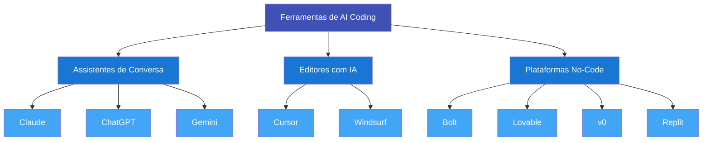

# Modulo 3: Ferramentas do Ecossistema

!!! info "Tempo estimado: 45 minutos"

## O que voce vai aprender

- Quais categorias de ferramentas de AI coding existem e para que serve cada uma
- Como escolher a ferramenta certa para cada tipo de tarefa
- O que cada plataforma oferece no plano gratuito
- Qual combinacao usar para comecar a construir seus primeiros projetos

---

## Visao geral

O ecossistema de AI coding cresceu rapidamente. Existem dezenas de ferramentas, e novas aparecem toda semana. A boa noticia: voce nao precisa conhecer todas. Precisa entender **tres categorias** e saber quando usar cada uma.



!!! tip "Analogia com engenharia"
    Pense em como voce ja usa ferramentas diferentes para fases diferentes de um projeto. AutoCAD para desenhar, Excel para calcular, MS Project para cronograma. Nenhuma ferramenta faz tudo sozinha -- voce combina conforme a necessidade.

    AI coding funciona igual. **Assistentes de conversa** sao como o bloco de notas onde voce pensa e planeja. **Plataformas no-code** sao como a impressora 3D que materializa o projeto. **Editores com IA** sao como o AutoCAD: mais controle, mais complexidade.

---

## Assistentes de conversa

Essa e a porta de entrada. Sao plataformas onde voce **conversa** com a IA usando linguagem natural. Servem para pensar, planejar, analisar documentos, gerar textos e ate escrever codigo.

Voce ja usou uma no Modulo 1. Agora, vamos entender as diferencas entre as principais.

=== "Claude"

    **O que e:** Assistente de IA criado pela Anthropic. Disponivel em [claude.ai](https://claude.ai){ target=_blank }.

    **Melhor para:** Documentos longos, analise detalhada, geracao de codigo, conversas com nuance e contexto.

    **Destaque:** Segue instrucoes com precisao e e transparente sobre suas limitacoes. Excelente para textos estruturados e raciocinio passo a passo.

    **Plano gratuito:** Uso diario generoso em claude.ai -- suficiente para a maioria dos projetos pessoais.

    !!! tip "Por que escolhemos Claude como ferramenta principal deste curso"
        Claude se destaca em entender contexto e produzir respostas bem organizadas. Quando voce pede algo complexo com varias restricoes, ele tende a manter tudo em mente. Isso e critico quando voce esta descrevendo um projeto inteiro.

    [:material-open-in-new: Acessar claude.ai](https://claude.ai){ target=_blank .md-button }

=== "ChatGPT"

    **O que e:** Assistente de IA criado pela OpenAI. O mais conhecido do mercado. Disponivel em [chat.openai.com](https://chat.openai.com){ target=_blank }.

    **Melhor para:** Uso geral, geracao de imagens (via DALL-E), amplo ecossistema de plugins.

    **Destaque:** Maior comunidade de usuarios. Encontra tutoriais, exemplos e dicas em praticamente qualquer lugar.

    **Plano gratuito:** Acesso ao modelo GPT-4o mini, funcional para tarefas do dia a dia.

    [:material-open-in-new: Acessar ChatGPT](https://chat.openai.com){ target=_blank .md-button }

=== "Gemini"

    **O que e:** Assistente de IA criado pelo Google. Disponivel em [gemini.google.com](https://gemini.google.com){ target=_blank }.

    **Melhor para:** Integracao com o ecossistema Google (Docs, Sheets, Gmail). Se voce ja vive no Google Workspace, Gemini se encaixa naturalmente.

    **Destaque:** Capacidades multimodais (entende texto, imagem e video) e janela de contexto grande.

    **Plano gratuito:** Disponivel via Google AI Studio e integrado ao Google Workspace.

    [:material-open-in-new: Acessar Gemini](https://gemini.google.com){ target=_blank .md-button }

!!! info "Todos fazem coisas parecidas"
    Na pratica, qualquer um dos tres resolve a maioria das tarefas de conversa e planejamento. A diferenca esta nos detalhes. Para este curso, usamos Claude como referencia, mas voce pode adaptar para o que preferir.

---

## Editores com IA

Se os assistentes de conversa sao para **pensar e planejar**, os editores com IA sao para **ver e modificar o codigo diretamente**. Pense neles como um AutoCAD com um assistente de IA embutido: voce enxerga cada detalhe do projeto e pode alterar qualquer coisa.

!!! warning "Opcional para iniciantes"
    Para a trilha principal deste curso, voce **nao precisa** de um editor com IA. Eles sao mais uteis quando voce ja tem alguma familiaridade com arquivos de codigo e quer mais controle. Mencionamos aqui para que voce saiba que existem.

=== "Cursor"

    **O que e:** Editor de codigo baseado no VS Code com IA profundamente integrada. Disponivel em [cursor.com](https://cursor.com){ target=_blank }.

    **Melhor para:** Projetos maiores onde voce quer ver, entender e modificar o codigo. Ideal quando voce comeca a querer mais controle sobre o que a IA gera.

    **Como funciona:** Voce abre seus arquivos de codigo, seleciona trechos e pede para a IA modificar, explicar ou completar. A IA entende o contexto do projeto inteiro.

    **Curva de aprendizado:** Moderada. Exige entendimento basico de arquivos e pastas de um projeto de software.

    **Plano gratuito:** Limitado, mas funcional para experimentar.

    [:material-open-in-new: Acessar Cursor](https://cursor.com){ target=_blank .md-button }

=== "Windsurf"

    **O que e:** Editor de codigo nativo com IA, similar ao Cursor. Disponivel em [windsurf.com](https://windsurf.com){ target=_blank }.

    **Melhor para:** Mesmo caso de uso do Cursor -- uma alternativa para quem prefere outra interface.

    **Curva de aprendizado:** Moderada, comparavel ao Cursor.

    **Plano gratuito:** Disponivel com limitacoes.

    [:material-open-in-new: Acessar Windsurf](https://windsurf.com){ target=_blank .md-button }

!!! tip "Quando migrar para um editor"
    Voce vai sentir a necessidade de um editor quando comecar a pensar: "quero mudar so essa parte especifica" ou "preciso organizar melhor os arquivos desse projeto". Ate la, as plataformas no-code resolvem.

---

## Plataformas no-code

Aqui e onde a magica acontece para quem esta comecando. Essas plataformas transformam descricoes em linguagem natural em **aplicacoes funcionais** -- tudo no navegador, sem instalar nada, sem configurar ambiente de desenvolvimento.

Voce descreve o que quer. A plataforma constroi. Voce testa e pede ajustes. Simples assim.

=== "Bolt"

    **O que e:** Plataforma da StackBlitz onde voce descreve um app e ele e construido ao vivo no navegador. Disponivel em [bolt.new](https://bolt.new){ target=_blank }.

    **Melhor para:** Aplicacoes web, prototipos rapidos, ferramentas visuais. Ideal para transformar uma ideia em algo funcional na mesma tarde.

    **Como funciona:** Voce digita o que quer (ex: "crie uma calculadora de custos de obra com campos para area, tipo de acabamento e regiao"). O Bolt gera o app completo em tempo real. Voce ve o resultado, pede mudancas, e ele ajusta.

    **Plano gratuito:** Quantidade limitada de geracoes por dia, mas suficiente para experimentar.

    !!! example "Experiencia tipica"
        1. Voce digita: "Crie um formulario que calcula o custo estimado de uma reforma"
        2. Em 30 segundos, um app funcional aparece na tela
        3. Voce testa: "Adicione um campo para tipo de piso"
        4. O Bolt atualiza o app instantaneamente

    **Veredito:** :material-star: **Recomendado para iniciantes.** E a forma mais direta de ir de ideia a prototipo.

    [:material-open-in-new: Acessar Bolt](https://bolt.new){ target=_blank .md-button .md-button--primary }

=== "Lovable"

    **O que e:** Construtor de apps com IA, com foco em interfaces bonitas e polidas. Disponivel em [lovable.dev](https://lovable.dev){ target=_blank }.

    **Melhor para:** Aplicacoes onde o design importa. Se voce quer que o resultado final tenha aparencia profissional, Lovable e uma otima escolha.

    **Diferenca do Bolt:** Mais enfase no visual e na experiencia do usuario. O resultado tende a parecer mais "acabado" esteticamente.

    **Plano gratuito:** Limitado em numero de projetos.

    [:material-open-in-new: Acessar Lovable](https://lovable.dev){ target=_blank .md-button }

=== "v0"

    **O que e:** Gerador de componentes de interface criado pela Vercel. Disponivel em [v0.dev](https://v0.dev){ target=_blank }.

    **Melhor para:** Gerar pecas especificas de interface -- um formulario, um dashboard, um menu de navegacao. Ideal para explorar opcoes de design.

    **Como funciona:** Voce descreve um elemento visual (ex: "um card de perfil com foto, nome e estatisticas"). O v0 gera varias opcoes para voce escolher e customizar.

    **Plano gratuito:** Disponivel com uso diario.

    [:material-open-in-new: Acessar v0](https://v0.dev){ target=_blank .md-button }

=== "Replit"

    **O que e:** Ambiente de desenvolvimento online com assistente de IA integrado. Disponivel em [replit.com](https://replit.com){ target=_blank }.

    **Melhor para:** Aprender a programar, projetos pequenos, experimentos rapidos. Tudo roda na nuvem -- nao precisa instalar nada no seu computador.

    **Como funciona:** Voce cria um projeto, conversa com a IA integrada e ve o resultado ao vivo. Funciona como um editor simplificado com execucao automatica.

    **Plano gratuito:** Generoso para projetos pessoais e aprendizado.

    [:material-open-in-new: Acessar Replit](https://replit.com){ target=_blank .md-button }

---

## Comparativo

| Ferramenta | Tipo | Melhor para | Gratis? | Curva de aprendizado | Para iniciar? |
|:---|:---|:---|:---:|:---:|:---:|
| **Claude** | Conversa | Analise e planejamento | :material-check: Sim | Facil | :material-star: Sim |
| **ChatGPT** | Conversa | Uso geral | :material-check: Sim | Facil | :material-star: Sim |
| **Gemini** | Conversa | Ecossistema Google | :material-check: Sim | Facil | Opcional |
| **Bolt** | No-code | Prototipos rapidos | :material-check: Limitado | Facil | :material-star: Sim |
| **Lovable** | No-code | Apps com design polido | :material-check: Limitado | Facil | :material-star: Sim |
| **v0** | No-code | Componentes de UI | :material-check: Sim | Facil | Opcional |
| **Replit** | Editor online | Experimentos | :material-check: Sim | Facil | Opcional |
| **Cursor** | Editor | Projetos maiores | :material-check: Limitado | Medio | Depois |
| **Windsurf** | Editor | Projetos maiores | :material-check: Limitado | Medio | Depois |

---

## Qual escolher para comecar?

Com tantas opcoes, e natural ficar em duvida. A resposta e simples:

!!! tip "Recomendacao para iniciantes"
    Comece com **Claude** (para conversar e planejar) + **Bolt** (para construir).

    Essa dupla cobre 90% do que voce precisa para os primeiros projetos.

**Por que essa combinacao funciona:**

- **Claude** e onde voce pensa. Descreve o problema, pede sugestoes, refina a ideia, estrutura os requisitos.
- **Bolt** e onde voce constroi. Pega a descricao que voce refinou no Claude e transforma em app funcional.

Pense assim: Claude e o escritorio de projetos; Bolt e o canteiro de obras.

!!! info "Conforme voce evolui"
    Depois dos primeiros projetos, explore **Lovable** quando quiser resultados visuais mais polidos. Experimente **Cursor** quando sentir vontade de abrir o "capo" e mexer no codigo diretamente. Mas nao tenha pressa -- comece com o basico e expanda conforme a necessidade.

---

## Exercicio pratico

### :material-keyboard: Comparando ferramentas na pratica

Hora de experimentar. O objetivo e criar uma conta nas duas ferramentas principais e sentir a diferenca entre **planejar com IA** e **construir com IA**.

**O que voce vai precisar:**

- 15-20 minutos
- Acesso a internet
- Uma ideia simples de ferramenta (veja exemplos abaixo)

**Passo a passo:**

**1. Crie suas contas** (se ainda nao tem):

- [claude.ai](https://claude.ai){ target=_blank } -- gratuito, basta um e-mail
- [bolt.new](https://bolt.new){ target=_blank } -- gratuito, basta um e-mail

**2. Escolha uma ferramenta simples que voce gostaria que existisse.** Exemplos:

!!! example "Ideias para seu exercicio"
    - Um conversor de unidades para sua area (metros para pes, PSI para MPa, etc.)
    - Um gerador de checklists para vistorias ou auditorias
    - Uma calculadora de custos simples para orcamentos rapidos
    - Um formulario que organiza informacoes de um projeto

**3. Planeje com Claude.** Abra o Claude e descreva sua ideia. Use o que aprendeu no Modulo 2 sobre prompts claros:

!!! example "Exemplo de prompt para o Claude"
    ```
    Preciso de uma ferramenta web simples que converta unidades
    de engenharia. Ela deve:

    - Converter entre metros, pes e polegadas
    - Converter entre PSI, MPa e kgf/cm2
    - Ter uma interface limpa com dois campos (valor de entrada
      e valor convertido)
    - Mostrar o resultado instantaneamente ao digitar

    Descreva como essa ferramenta deveria funcionar e que
    campos ela precisa ter.
    ```

**4. Construa com Bolt.** Agora va ao Bolt e use a descricao que o Claude ajudou a refinar. Cole ou reescreva sua ideia diretamente no Bolt:

!!! example "Exemplo de prompt para o Bolt"
    ```
    Crie um conversor de unidades de engenharia com:
    - Conversao entre metros, pes e polegadas
    - Conversao entre PSI, MPa e kgf/cm2
    - Interface limpa com selecao de unidade de origem e destino
    - Resultado em tempo real ao digitar o valor
    ```

**5. Compare as experiencias.** Observe:

- O Claude ajudou a **estruturar** a ideia?
- O Bolt **construiu** algo funcional?
- O resultado ficou proximo do que voce imaginou?

!!! tip "O segredo"
    A combinacao ideal e: use Claude para **PENSAR e PLANEJAR**, e uma plataforma como Bolt para **CONSTRUIR**. Um alimenta o outro. Quanto melhor seu planejamento no Claude, melhor o resultado no Bolt.

---

## Resumo

- **Tres categorias de ferramentas:** assistentes de conversa (para pensar), plataformas no-code (para construir) e editores com IA (para controle total)
- **Para comecar, voce so precisa de duas:** Claude + Bolt cobrem a grande maioria dos casos
- **Todas as ferramentas tem planos gratuitos** -- voce nao precisa gastar nada para experimentar
- **A escolha da ferramenta depende da tarefa:** planejar, construir e refinar pedem ferramentas diferentes
- **Nao tente aprender tudo de uma vez.** Domine o basico e expanda conforme a necessidade

---

## Proximo passo

Voce ja sabe o que e AI coding (Modulo 1), como se comunicar com a IA (Modulo 2) e quais ferramentas usar (Modulo 3). Agora e hora de juntar tudo e **construir seu primeiro aplicativo do zero**. No Modulo 4, voce vai passar por todo o processo -- da ideia ao app funcionando.

Enquanto o Modulo 4 nao esta disponivel, aproveite para praticar: explore o Claude e o Bolt com ideias do seu dia a dia. Cada experimento consolida o que voce aprendeu ate aqui.

[Voltar para a trilha :material-arrow-right:](index.md){ .md-button .md-button--primary }
