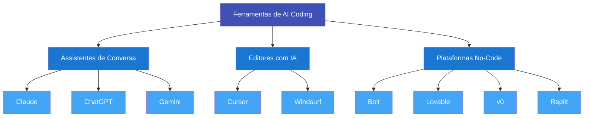

# Módulo 3: Ferramentas do Ecossistema

!!! info "Tempo estimado: 45 minutos"

## O que você vai aprender

- Quais categorias de ferramentas de AI coding existem e para que serve cada uma
- Como escolher a ferramenta certa para cada tipo de tarefa
- O que cada plataforma oferece no plano gratuito
- Qual combinação usar para começar a construir seus primeiros projetos

---

## Visão geral

O ecossistema de AI coding cresceu rapidamente. Existem dezenas de ferramentas, e novas aparecem toda semana. A boa notícia: você não precisa conhecer todas. Precisa entender **três categorias** e saber quando usar cada uma.



!!! tip "Analogia com engenharia"
    Pense em como você já usa ferramentas diferentes para fases diferentes de um projeto. AutoCAD para desenhar, Excel para calcular, MS Project para cronograma. Nenhuma ferramenta faz tudo sozinha -- você combina conforme a necessidade.

    AI coding funciona igual. **Assistentes de conversa** são como o bloco de notas onde você pensa e planeja. **Plataformas no-code** são como a impressora 3D que materializa o projeto. **Editores com IA** são como o AutoCAD: mais controle, mais complexidade.

---

## Assistentes de conversa

Essa é a porta de entrada. São plataformas onde você **conversa** com a IA usando linguagem natural. Servem para pensar, planejar, analisar documentos, gerar textos e até escrever código.

Você já usou uma no Módulo 1. Agora, vamos entender as diferenças entre as principais.

=== "Claude"

    **O que é:** Assistente de IA criado pela Anthropic. Disponível em [claude.ai](https://claude.ai){ target=_blank }.

    **Melhor para:** Documentos longos, análise detalhada, geração de código, conversas com nuance e contexto.

    **Destaque:** Segue instruções com precisão e é transparente sobre suas limitações. Excelente para textos estruturados e raciocínio passo a passo.

    **Plano gratuito:** Uso diário generoso em claude.ai -- suficiente para a maioria dos projetos pessoais.

    !!! tip "Por que escolhemos Claude como ferramenta principal deste curso"
        Claude se destaca em entender contexto e produzir respostas bem organizadas. Quando você pede algo complexo com várias restrições, ele tende a manter tudo em mente. Isso é crítico quando você está descrevendo um projeto inteiro.

    [:material-open-in-new: Acessar claude.ai](https://claude.ai){ target=_blank .md-button }

=== "ChatGPT"

    **O que é:** Assistente de IA criado pela OpenAI. O mais conhecido do mercado. Disponível em [chat.openai.com](https://chat.openai.com){ target=_blank }.

    **Melhor para:** Uso geral, geração de imagens (via DALL-E), amplo ecossistema de plugins.

    **Destaque:** Maior comunidade de usuários. Encontra tutoriais, exemplos e dicas em praticamente qualquer lugar.

    **Plano gratuito:** Acesso ao modelo GPT-4o mini, funcional para tarefas do dia a dia.

    [:material-open-in-new: Acessar ChatGPT](https://chat.openai.com){ target=_blank .md-button }

=== "Gemini"

    **O que é:** Assistente de IA criado pelo Google. Disponível em [gemini.google.com](https://gemini.google.com){ target=_blank }.

    **Melhor para:** Integração com o ecossistema Google (Docs, Sheets, Gmail). Se você já vive no Google Workspace, Gemini se encaixa naturalmente.

    **Destaque:** Capacidades multimodais (entende texto, imagem e vídeo) e janela de contexto grande.

    **Plano gratuito:** Disponível via Google AI Studio e integrado ao Google Workspace.

    [:material-open-in-new: Acessar Gemini](https://gemini.google.com){ target=_blank .md-button }

!!! info "Todos fazem coisas parecidas"
    Na prática, qualquer um dos três resolve a maioria das tarefas de conversa e planejamento. A diferença está nos detalhes. Para este curso, usamos Claude como referência, mas você pode adaptar para o que preferir.

---

## Editores com IA

Se os assistentes de conversa são para **pensar e planejar**, os editores com IA são para **ver e modificar o código diretamente**. Pense neles como um AutoCAD com um assistente de IA embutido: você enxerga cada detalhe do projeto e pode alterar qualquer coisa.

!!! warning "Opcional para iniciantes"
    Para a trilha principal deste curso, você **não precisa** de um editor com IA. Eles são mais úteis quando você já tem alguma familiaridade com arquivos de código e quer mais controle. Mencionamos aqui para que você saiba que existem.

=== "Cursor"

    **O que é:** Editor de código baseado no VS Code com IA profundamente integrada. Disponível em [cursor.com](https://cursor.com){ target=_blank }.

    **Melhor para:** Projetos maiores onde você quer ver, entender e modificar o código. Ideal quando você começa a querer mais controle sobre o que a IA gera.

    **Como funciona:** Você abre seus arquivos de código, seleciona trechos e pede para a IA modificar, explicar ou completar. A IA entende o contexto do projeto inteiro.

    **Curva de aprendizado:** Moderada. Exige entendimento básico de arquivos e pastas de um projeto de software.

    **Plano gratuito:** Limitado, mas funcional para experimentar.

    [:material-open-in-new: Acessar Cursor](https://cursor.com){ target=_blank .md-button }

=== "Windsurf"

    **O que é:** Editor de código nativo com IA, similar ao Cursor. Disponível em [windsurf.com](https://windsurf.com){ target=_blank }.

    **Melhor para:** Mesmo caso de uso do Cursor -- uma alternativa para quem prefere outra interface.

    **Curva de aprendizado:** Moderada, comparável ao Cursor.

    **Plano gratuito:** Disponível com limitações.

    [:material-open-in-new: Acessar Windsurf](https://windsurf.com){ target=_blank .md-button }

!!! tip "Quando migrar para um editor"
    Você vai sentir a necessidade de um editor quando começar a pensar: "quero mudar só essa parte específica" ou "preciso organizar melhor os arquivos desse projeto". Até lá, as plataformas no-code resolvem.

---

## Plataformas no-code

Aqui é onde a mágica acontece para quem está começando. Essas plataformas transformam descrições em linguagem natural em **aplicações funcionais** -- tudo no navegador, sem instalar nada, sem configurar ambiente de desenvolvimento.

Você descreve o que quer. A plataforma constrói. Você testa e pede ajustes. Simples assim.

=== "Bolt"

    **O que é:** Plataforma da StackBlitz onde você descreve um app e ele é construído ao vivo no navegador. Disponível em [bolt.new](https://bolt.new){ target=_blank }.

    **Melhor para:** Aplicações web, protótipos rápidos, ferramentas visuais. Ideal para transformar uma ideia em algo funcional na mesma tarde.

    **Como funciona:** Você digita o que quer (ex: "crie uma calculadora de custos de obra com campos para área, tipo de acabamento e região"). O Bolt gera o app completo em tempo real. Você vê o resultado, pede mudanças, e ele ajusta.

    **Plano gratuito:** Quantidade limitada de gerações por dia, mas suficiente para experimentar.

    !!! example "Experiência típica"
        1. Você digita: "Crie um formulário que calcula o custo estimado de uma reforma"
        2. Em 30 segundos, um app funcional aparece na tela
        3. Você testa: "Adicione um campo para tipo de piso"
        4. O Bolt atualiza o app instantaneamente

    **Veredito:** :material-star: **Recomendado para iniciantes.** É a forma mais direta de ir de ideia a protótipo.

    [:material-open-in-new: Acessar Bolt](https://bolt.new){ target=_blank .md-button .md-button--primary }

=== "Lovable"

    **O que é:** Construtor de apps com IA, com foco em interfaces bonitas e polidas. Disponível em [lovable.dev](https://lovable.dev){ target=_blank }.

    **Melhor para:** Aplicações onde o design importa. Se você quer que o resultado final tenha aparência profissional, Lovable é uma ótima escolha.

    **Diferença do Bolt:** Mais ênfase no visual e na experiência do usuário. O resultado tende a parecer mais "acabado" esteticamente.

    **Plano gratuito:** Limitado em número de projetos.

    [:material-open-in-new: Acessar Lovable](https://lovable.dev){ target=_blank .md-button }

=== "v0"

    **O que é:** Gerador de componentes de interface criado pela Vercel. Disponível em [v0.dev](https://v0.dev){ target=_blank }.

    **Melhor para:** Gerar peças específicas de interface -- um formulário, um dashboard, um menu de navegação. Ideal para explorar opções de design.

    **Como funciona:** Você descreve um elemento visual (ex: "um card de perfil com foto, nome e estatísticas"). O v0 gera várias opções para você escolher e customizar.

    **Plano gratuito:** Disponível com uso diário.

    [:material-open-in-new: Acessar v0](https://v0.dev){ target=_blank .md-button }

=== "Replit"

    **O que é:** Ambiente de desenvolvimento online com assistente de IA integrado. Disponível em [replit.com](https://replit.com){ target=_blank }.

    **Melhor para:** Aprender a programar, projetos pequenos, experimentos rápidos. Tudo roda na nuvem -- não precisa instalar nada no seu computador.

    **Como funciona:** Você cria um projeto, conversa com a IA integrada e vê o resultado ao vivo. Funciona como um editor simplificado com execução automática.

    **Plano gratuito:** Generoso para projetos pessoais e aprendizado.

    [:material-open-in-new: Acessar Replit](https://replit.com){ target=_blank .md-button }

---

## Comparativo

| Ferramenta | Tipo | Melhor para | Grátis? | Curva de aprendizado | Para iniciar? |
|:---|:---|:---|:---:|:---:|:---:|
| **Claude** | Conversa | Análise e planejamento | :material-check: Sim | Fácil | :material-star: Sim |
| **ChatGPT** | Conversa | Uso geral | :material-check: Sim | Fácil | :material-star: Sim |
| **Gemini** | Conversa | Ecossistema Google | :material-check: Sim | Fácil | Opcional |
| **Bolt** | No-code | Protótipos rápidos | :material-check: Limitado | Fácil | :material-star: Sim |
| **Lovable** | No-code | Apps com design polido | :material-check: Limitado | Fácil | :material-star: Sim |
| **v0** | No-code | Componentes de UI | :material-check: Sim | Fácil | Opcional |
| **Replit** | Editor online | Experimentos | :material-check: Sim | Fácil | Opcional |
| **Cursor** | Editor | Projetos maiores | :material-check: Limitado | Médio | Depois |
| **Windsurf** | Editor | Projetos maiores | :material-check: Limitado | Médio | Depois |

---

## Qual escolher para começar?

Com tantas opções, é natural ficar em dúvida. A resposta é simples:

!!! tip "Recomendação para iniciantes"
    Comece com **Claude** (para conversar e planejar) + **Bolt** (para construir).

    Essa dupla cobre 90% do que você precisa para os primeiros projetos.

**Por que essa combinação funciona:**

- **Claude** é onde você pensa. Descreve o problema, pede sugestões, refina a ideia, estrutura os requisitos.
- **Bolt** é onde você constrói. Pega a descrição que você refinou no Claude e transforma em app funcional.

Pense assim: Claude é o escritório de projetos; Bolt é o canteiro de obras.

!!! info "Conforme você evolui"
    Depois dos primeiros projetos, explore **Lovable** quando quiser resultados visuais mais polidos. Experimente **Cursor** quando sentir vontade de abrir o "capô" e mexer no código diretamente. Mas não tenha pressa -- comece com o básico e expanda conforme a necessidade.

---

## Exercício prático

### :material-keyboard: Comparando ferramentas na prática

Hora de experimentar. O objetivo é criar uma conta nas duas ferramentas principais e sentir a diferença entre **planejar com IA** e **construir com IA**.

**O que você vai precisar:**

- 15-20 minutos
- Acesso à internet
- Uma ideia simples de ferramenta (veja exemplos abaixo)

**Passo a passo:**

**1. Crie suas contas** (se ainda não tem):

- [claude.ai](https://claude.ai){ target=_blank } -- gratuito, basta um e-mail
- [bolt.new](https://bolt.new){ target=_blank } -- gratuito, basta um e-mail

**2. Escolha uma ferramenta simples que você gostaria que existisse.** Exemplos:

!!! example "Ideias para seu exercício"
    - Um conversor de unidades para sua área (metros para pés, PSI para MPa, etc.)
    - Um gerador de checklists para vistorias ou auditorias
    - Uma calculadora de custos simples para orçamentos rápidos
    - Um formulário que organiza informações de um projeto

**3. Planeje com Claude.** Abra o Claude e descreva sua ideia. Use o que aprendeu no Módulo 2 sobre prompts claros:

!!! example "Exemplo de prompt para o Claude"
    ```
    Preciso de uma ferramenta web simples que converta unidades
    de engenharia. Ela deve:

    - Converter entre metros, pés e polegadas
    - Converter entre PSI, MPa e kgf/cm²
    - Ter uma interface limpa com dois campos (valor de entrada
      e valor convertido)
    - Mostrar o resultado instantaneamente ao digitar

    Descreva como essa ferramenta deveria funcionar e que
    campos ela precisa ter.
    ```

**4. Construa com Bolt.** Agora vá ao Bolt e use a descrição que o Claude ajudou a refinar. Cole ou reescreva sua ideia diretamente no Bolt:

!!! example "Exemplo de prompt para o Bolt"
    ```
    Crie um conversor de unidades de engenharia com:
    - Conversão entre metros, pés e polegadas
    - Conversão entre PSI, MPa e kgf/cm²
    - Interface limpa com seleção de unidade de origem e destino
    - Resultado em tempo real ao digitar o valor
    ```

**5. Compare as experiências.** Observe:

- O Claude ajudou a **estruturar** a ideia?
- O Bolt **construiu** algo funcional?
- O resultado ficou próximo do que você imaginou?

!!! tip "O segredo"
    A combinação ideal é: use Claude para **PENSAR e PLANEJAR**, e uma plataforma como Bolt para **CONSTRUIR**. Um alimenta o outro. Quanto melhor seu planejamento no Claude, melhor o resultado no Bolt.

---

## Resumo

- **Três categorias de ferramentas:** assistentes de conversa (para pensar), plataformas no-code (para construir) e editores com IA (para controle total)
- **Para começar, você só precisa de duas:** Claude + Bolt cobrem a grande maioria dos casos
- **Todas as ferramentas têm planos gratuitos** -- você não precisa gastar nada para experimentar
- **A escolha da ferramenta depende da tarefa:** planejar, construir e refinar pedem ferramentas diferentes
- **Não tente aprender tudo de uma vez.** Domine o básico e expanda conforme a necessidade

---

## Próximo passo

Você já sabe o que é AI coding (Módulo 1), como se comunicar com a IA (Módulo 2) e quais ferramentas usar (Módulo 3). Agora é hora de juntar tudo e **construir seu primeiro aplicativo do zero**. No Módulo 4, você vai passar por todo o processo -- da ideia ao app funcionando.

Enquanto o Módulo 4 não está disponível, aproveite para praticar: explore o Claude e o Bolt com ideias do seu dia a dia. Cada experimento consolida o que você aprendeu até aqui.

[Voltar para a trilha :material-arrow-right:](index.md){ .md-button .md-button--primary }
