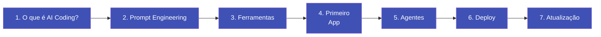

# Trilha de Aprendizado

Siga os módulos na ordem abaixo. Cada um constrói sobre o anterior.

!!! info "Tempo total estimado: 5-6 horas"
    Você pode completar no seu ritmo. Não precisa fazer tudo de uma vez.

---

## Sua jornada

*Todos os módulos estão disponíveis. Siga a ordem — cada um constrói sobre o anterior.*

---

## Módulos

### :material-lightbulb-outline: [Módulo 1 -- O que é AI Coding?](01-o-que-e-ai-coding.md)
**30 min** | Entenda o que é possível construir com IA, como funciona o "vibe coding" e por que isso muda tudo para profissionais não-programadores.

---

### :material-chat-processing-outline: [Módulo 2 -- Prompt Engineering](02-prompt-engineering.md)
**45 min** | Aprenda a se comunicar com a IA de forma eficiente. Domine técnicas de construção de prompts e veja a diferença que instruções claras fazem.

---

### :material-toolbox-outline: [Módulo 3 -- Ferramentas do Ecossistema](03-ferramentas.md)
**45 min** | Conheça as principais plataformas de AI coding: Claude, Cursor, Bolt, Lovable e mais. Saiba qual usar para cada situação.

---

### :material-rocket-launch-outline: [Módulo 4 -- Seu Primeiro App](04-primeiro-app.md)
**60 min** | Construa um aplicativo funcional do zero usando IA. Do prompt inicial à primeira versão publicada.

---

### :material-robot-outline: [Módulo 5 -- Agentes de IA](05-agentes.md)
**45 min** | Aprenda o que são agentes e como colocar múltiplas IAs para trabalhar em equipe, resolvendo tarefas complexas de forma autônoma.

---

### :material-cloud-upload-outline: [Módulo 6 -- Publicar e Lançar](06-deploy.md)
**30 min** | Publique seu app para que qualquer pessoa possa acessar — de graça, sem servidor, sem configuração complexa.

---

### :material-newspaper-variant-outline: [Módulo 7 -- Mantendo-se Atualizado](07-atualizado.md)
**20 min** | Monte uma rotina simples e sustentável para acompanhar as novidades sem se afogar em informação.
