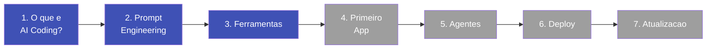

# Trilha de Aprendizado

Siga os modulos na ordem abaixo. Cada um constroi sobre o anterior.

!!! info "Tempo total estimado: 4-5 horas"
    Voce pode completar no seu ritmo. Nao precisa fazer tudo de uma vez.

---

## Sua jornada

*Modulos em azul estao disponiveis. Os demais serao publicados em breve.*

---

## Modulos disponiveis

### :material-lightbulb-outline: [Modulo 1 -- O que e AI Coding?](01-o-que-e-ai-coding.md)
**Tempo estimado: 30 min** | Entenda o que e possivel construir com IA, como funciona o "vibe coding" e por que isso muda tudo para profissionais nao-programadores.

---

### :material-chat-processing-outline: [Modulo 2 -- Prompt Engineering](02-prompt-engineering.md)
**Tempo estimado: 45 min** | Aprenda a se comunicar com a IA de forma eficiente. Domine tecnicas de construcao de prompts e veja a diferenca que instrucoes claras fazem.

---

### :material-toolbox-outline: [Modulo 3 -- Ferramentas do Ecossistema](03-ferramentas.md)
**Tempo estimado: 45 min** | Conheca as principais plataformas de AI coding: Claude, Cursor, Bolt, Lovable e mais. Saiba qual usar para cada situacao.

---

## Em breve

### :material-rocket-launch-outline: Modulo 4 -- Seu Primeiro App
Construa um aplicativo funcional do zero usando IA.

### :material-robot-outline: Modulo 5 -- Orquestracao de Agentes
Aprenda a combinar multiplas IAs para resolver problemas complexos.

### :material-cloud-upload-outline: Modulo 6 -- Deploy e Lancamento
Publique seu app para que qualquer pessoa possa usar.

### :material-newspaper-variant-outline: Modulo 7 -- Mantendo-se Atualizado
Monte uma rotina para acompanhar as novidades desse mundo que muda toda semana.
