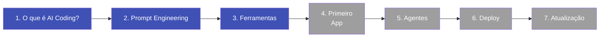

# Trilha de Aprendizado

Siga os módulos na ordem abaixo. Cada um constrói sobre o anterior.

!!! info "Tempo total estimado: 4-5 horas"
    Você pode completar no seu ritmo. Não precisa fazer tudo de uma vez.

---

## Sua jornada

*Módulos em azul estão disponíveis. Os demais serão publicados em breve.*

---

## Módulos disponíveis

### :material-lightbulb-outline: [Módulo 1 -- O que é AI Coding?](01-o-que-e-ai-coding.md)
**Tempo estimado: 30 min** | Entenda o que é possível construir com IA, como funciona o "vibe coding" e por que isso muda tudo para profissionais não-programadores.

---

### :material-chat-processing-outline: [Módulo 2 -- Prompt Engineering](02-prompt-engineering.md)
**Tempo estimado: 45 min** | Aprenda a se comunicar com a IA de forma eficiente. Domine técnicas de construção de prompts e veja a diferença que instruções claras fazem.

---

### :material-toolbox-outline: [Módulo 3 -- Ferramentas do Ecossistema](03-ferramentas.md)
**Tempo estimado: 45 min** | Conheça as principais plataformas de AI coding: Claude, Cursor, Bolt, Lovable e mais. Saiba qual usar para cada situação.

---

## Em breve

### :material-rocket-launch-outline: Módulo 4 -- Seu Primeiro App
Construa um aplicativo funcional do zero usando IA.

### :material-robot-outline: Módulo 5 -- Orquestração de Agentes
Aprenda a combinar múltiplas IAs para resolver problemas complexos.

### :material-cloud-upload-outline: Módulo 6 -- Deploy e Lançamento
Publique seu app para que qualquer pessoa possa usar.

### :material-newspaper-variant-outline: Módulo 7 -- Mantendo-se Atualizado
Monte uma rotina para acompanhar as novidades desse mundo que muda toda semana.
